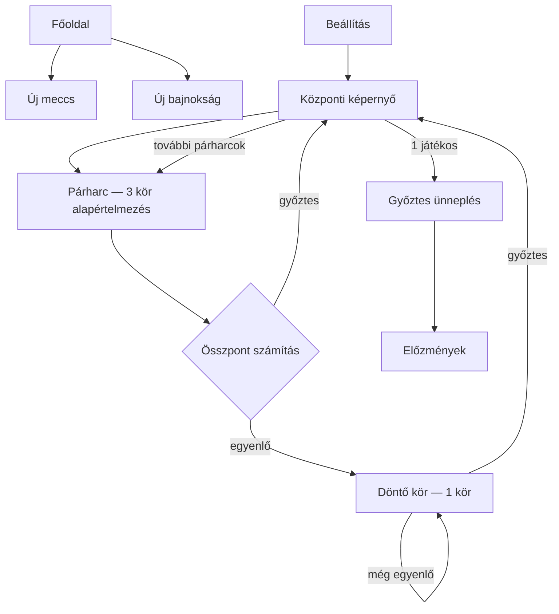
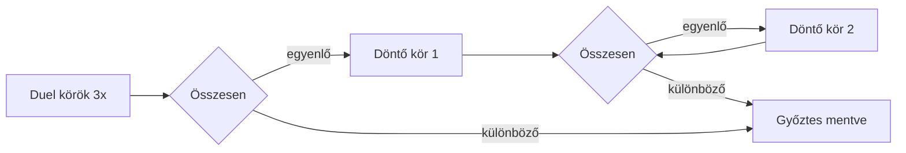
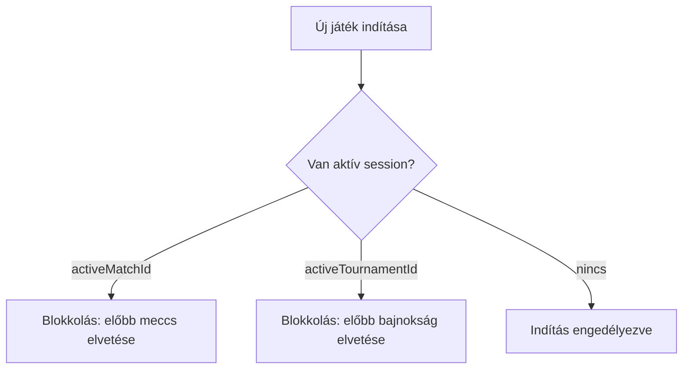

# Bajnokság mód — implementation plan

**Status:** Plan only — do not implement until the normal Meccs flow is stable and this document is approved.

**App:** Szilveszter Cup: Lengő Teke Championship (Vite + React + TypeScript)

---

## Prerequisite warning

> **Bajnokság should only be implemented after the normal Meccs flow is stable.**
>
> Before starting Phase 1, verify: score entry, round titles, placement titles, match end, history, backup/restore, and home navigation all work reliably for **Meccs**. Tournament work must not refactor or regress existing match code paths.

---

## Constraints (non-negotiable)

| Rule | Detail |
|------|--------|
| Storage | localStorage only (`lengoteke:v1:state` pattern); no backend, database, API routes, or authentication |
| UI language | Hungarian only |
| Layout | Mobile-first, outdoor-friendly large touch targets |
| Meccs | **Do not change** the normal Meccs flow — matches, round titles, placement titles, and match history remain stable |
| Bajnokság | Separate **game mode**, not a replacement for Meccs |
| Data | **Separate `Tournament` model** — do not merge tournament state into existing `Match` |
| Active session | Exactly one: `activeMatchId` **OR** `activeTournamentId` — **never both** |
| Duel default | Bajnokság duel: **3 rounds** default (configurable 1–10 at setup). Normal Meccs round count unchanged |

---

## Product summary

Knockout tournament: players are paired, each pair plays a short **párharc** (duel). Only the winner advances. Repeat until one **Bajnokság győztese** remains.



---

## Routes and screens

| Route | Screen | Purpose |
|-------|--------|---------|
| `/` | `HomePage` | **Új meccs** + **Új bajnokság**; **Folytatás** for active Meccs or Bajnokság (never both) |
| `/tournament/new` | `TournamentNewPage` | Setup: players (min 2), shuffle, rounds per duel (default **3**) |
| `/tournament` | `TournamentHubPage` | **Tournament progress** (see below) + start next duel |
| `/tournament/duel` | `TournamentDuelPage` | Score entry for current duel (`roundsPerDuel` rounds) |
| `/tournament/duel/tiebreak` | `TournamentTiebreakPage` | **One tie-break round only** — no manual winner |
| `/tournament/champion` | `TournamentChampionPage` | Celebration + finalize |
| `/history` | `HistoryPage` | Unified list: Meccs + Bajnokság |
| `/history/match/:id` | Existing match detail | Unchanged |
| `/history/tournament/:id` | `TournamentHistoryDetail` | Bracket / round results |

Add routes in `src/App.tsx`. Redirect unknown tournament state to `/tournament` or `/`.

---

## Tournament progress UI (`TournamentHubPage`)

Always visible while Bajnokság is active. Hungarian labels, compact mobile layout.

| Block | Content | Example |
|-------|---------|---------|
| **Aktuális szakasz** | Current bracket round label | `Elődöntő` |
| **Hátralévő játékosok** | Count (and optional names) of players still in contention | `4 játékos` |
| **Hátralévő párharcok** | Pending duels in current bracket round | `2 párharc` |
| **Továbbjutók** | Players who already won this round (incl. **erőnyerő** if bye applies) | Chips / list |
| **Aktuális párharc** | Current or next duel to play | `Apa vs Józsi` |
| **Erőnyerő** | If `byePlayerId` set for current round | `Mama — erőnyerő` |

Primary CTA: **Párharc indítása** / **Folytatás — {A} vs {B}** when duel in progress.

Secondary: **Bajnokság elvetése** (confirm dialog; no history entry).

---

## Data model

Keep `Match` in `src/types/index.ts` **unchanged** in shape and behavior. Add tournament types (same file or `src/types/tournament.ts` re-exported).

```ts
export type TournamentId = string;
export type DuelId = string;
export type TournamentStatus = 'active' | 'completed';
export type DuelStatus = 'pending' | 'active' | 'completed';

/** Default at setup; constant DEFAULT_TOURNAMENT_DUEL_ROUNDS = 3 */
export interface TournamentDuel {
  id: DuelId;
  playerAId: PlayerId;
  playerBId: PlayerId;
  rounds: Round[];              // reuse Round / RoundScore — exactly 2 players
  winnerId: PlayerId | null;
  status: DuelStatus;
  /** Extra single-round playoffs when main duel totals are tied. No manual winner. */
  tieBreakRounds?: Round[];
}

export interface TournamentBracketRound {
  index: number;                // 1-based
  label: string;                // "1. forduló" | "Elődöntő" | "Döntő"
  duels: TournamentDuel[];
  byePlayerId?: PlayerId;       // erőnyerő
}

export interface Tournament {
  id: TournamentId;
  name: string;
  playerIds: PlayerId[];
  roundsPerDuel: number;        // default 3
  status: TournamentStatus;
  currentRoundIndex: number;
  activeDuelId: DuelId | null;
  bracketRounds: TournamentBracketRound[];
  championId?: PlayerId;
  createdAt: string;
  completedAt?: string;
}

export interface AppState {
  schemaVersion: 2;
  players: Player[];
  matches: Match[];             // unchanged usage
  tournaments: Tournament[];
  activeMatchId: MatchId | null;
  activeTournamentId: TournamentId | null;
}
```

**Constants** (`src/constants/tournament.ts`):

```ts
export const DEFAULT_TOURNAMENT_DUEL_ROUNDS = 3;
export const MIN_TOURNAMENT_DUEL_ROUNDS = 1;
export const MAX_TOURNAMENT_DUEL_ROUNDS = 10;
export const TIE_BREAK_ROUNDS_PER_PLAYOFF = 1;
```

---

## localStorage and migration

| Item | Change |
|------|--------|
| `SCHEMA_VERSION` | `1` → `2` |
| `migrate.ts` | v1 → v2: `tournaments: []`, `activeTournamentId: null` |
| `loadState.ts` | Normalize tournaments, bracket rounds, duels, rounds (mirror match normalization) |
| `defaultState.ts` | `tournaments: []`, `activeTournamentId: null` |
| Backup panel | No key change; JSON includes `tournaments` automatically |
| Prune | `MAX_COMPLETED_TOURNAMENTS = 50` (mirror matches) |

**Invariants (enforce in helpers):**

- `activeMatchId !== null` ⇒ `activeTournamentId === null`
- `activeTournamentId !== null` ⇒ `activeMatchId === null`
- Starting Bajnokság while Meccs active: block UI; user must **elvetés** Meccs first (same as today’s “already running match” pattern)

---

## Pairing algorithm

### First bracket round — `buildFirstBracketRound(entrantIds, options)`

1. Start from selected player IDs (min 2).
2. If **shuffle** enabled: Fisher–Yates shuffle once at setup.
3. Pair sequentially: `[0,1], [2,3], …`
4. Odd count: last player → `byePlayerId` (**erőnyerő**), no duel for that player this round.
5. Create `TournamentDuel` per pair with `createEmptyRounds([playerA, playerB], roundsPerDuel)`.

### Advance — `advanceBracket(tournament)`

When all duels in `currentRoundIndex` are `completed`:

1. Collect winners from completed duels (in duel order).
2. Append `byePlayerId` for that round to the pool (if any).
3. If `pool.length === 1` → set `championId`, route to champion screen.
4. If `pool.length` is odd → next round gets new `byePlayerId` from unpaired player.
5. Pair pool sequentially into new duels; increment `currentRoundIndex`; set label via `getRoundLabel(pool.length, roundIndex)`.

### Round labels — `getRoundLabel(remainingPlayers, roundIndex)`

| Remaining players | Label |
|-------------------|--------|
| 2 | Döntő |
| 4 | Elődöntő |
| 8 | Negyedfődöntő |
| other | `{roundIndex}. forduló` |

### Progress helpers — `getTournamentProgress(tournament, players)`

Returns:

- `roundLabel`
- `remainingPlayerCount` + ids
- `remainingDuelCount` (pending in current bracket round)
- `advancedPlayerIds` (winners this round + bye player)
- `currentDuel` (active or next pending)
- `byePlayerId` if any

---

## Duel scoring and winner

### Main duel (N = `roundsPerDuel`, default 3)

- Reuse `RoundScoreGrid`, `RoundNavigator`, `isRoundComplete`, `getPlayerTotal` logic.
- When all N rounds complete: `totalA` vs `totalB`.

| Result | Action |
|--------|--------|
| `totalA > totalB` | `winnerId = playerA`, duel `completed` |
| `totalB > totalA` | `winnerId = playerB`, duel `completed` |
| `totalA === totalB` | Navigate to **tie-break** flow — **no manual winner selection** |

### Tie-break round logic (required change)

**Out of scope:** Manual “pick winner” buttons.

**In scope only:**

1. Show `TournamentTiebreakPage` with Hungarian copy: e.g. *„Döntetlen az összpontban — döntő kör!”*
2. Play **exactly 1 tie-break round** per playoff step (`TIE_BREAK_ROUNDS_PER_PLAYOFF = 1`).
3. Store in `duel.tieBreakRounds` (append each playoff).
4. Compare tie-break round totals for the two players.
5. If still tied → play **another** single tie-break round (repeat until totals differ; 0–10 integers make prolonged ties rare).
6. Set `winnerId` from tie-break result; mark duel `completed`; return to hub.



---

## Champion celebration screen

`TournamentChampionPage` — strong visual focus, Hungarian copy.

| Element | Spec |
|---------|------|
| Title | Large **„Bajnokság győztese”** (primary heading, gold, prominent) |
| Name | Champion display name, large |
| Trophy | CSS trophy-style visual (SVG inline or pure CSS — no image CDN); cup + glow |
| Confetti | **Optional:** CSS-only particles (`@keyframes`, fixed overlay, ~2–3s); **no** canvas libraries or heavy deps |
| Sound | **Optional:** short applause via HTML5 `Audio` + file in `public/sounds/applause.mp3`; mute if load fails; **no** howler.js etc. |
| Actions | **Befejezés** → persist `status: completed`, `completedAt`, prune, clear `activeTournamentId`, navigate home |

Finalize stores tournament in `tournaments[]` for history (do not touch `matches[]`).

---

## History integration

### Unified list (`HistoryPage` + `HistoryList`)

- `getHistoryEntries(state)` merges completed matches + completed tournaments, sorted by date desc.
- Each card shows badge: **Meccs** or **Bajnokság**.
- Match cards: existing layout unchanged.
- Tournament card: name, date, `{n} játékos · {rounds} szakasz · Győztes: {name}`.

### Tournament detail (`TournamentHistoryDetail`)

- Read-only `TournamentBracketView`: rounds → duels → scores → winners.
- Highlight champion; show **erőnyerő** on rounds where applicable.
- Show tie-break rounds under duel if played.

### Routes

- Split detail URLs: `/history/match/:id` vs `/history/tournament/:id` so match detail code stays isolated.

---

## Active session rules (Meccs vs Bajnokság)



- Home shows at most one **Folytatás** primary button.
- `MatchSetupForm` / `TournamentSetupForm` each guard against the other active session.

---

## UI components (new)

| Component | Role |
|-----------|------|
| `TournamentSetupForm` | Players, shuffle, round stepper (default 3) |
| `TournamentProgressPanel` | Hub progress blocks (5 sections above) |
| `TournamentHubPage` | Orchestrates progress + duel CTA + abandon |
| `TournamentDuelPage` | `{A} vs {B}`, N-round scoring |
| `TournamentTiebreakPage` | Single-round playoff only; auto-repeat if tied |
| `TournamentChampionPage` | Celebration layout + optional effects |
| `TournamentBracketView` | History bracket |
| `TournamentTrophy` | CSS/SVG trophy visual |
| `useActiveTournament` | Mirror `useActiveMatch` |

**Reuse (read-only integration):** `RoundScoreGrid`, `RoundNavigator`, `AppShell`, `PageHeader`, `ConfirmDialog`, `createEmptyRounds`, `parseScoreInput`.

---

## Implementation phases

One phase per session. Run `npm run build` after each. **Do not start until Meccs is stable.**

### Phase 0 — Plan sign-off

- This file reviewed and approved.
- Confirm Meccs regression checklist passes.

### Phase 1 — Data layer (no UI)

- Tournament types + `schemaVersion: 2` migration
- `utils/tournament.ts`: pairing, labels, progress helpers, duel totals, tie-break resolution loop
- `constants/tournament.ts` with `DEFAULT_TOURNAMENT_DUEL_ROUNDS = 3`
- Unit-test pairing edge cases (2 players, odd bye, 8→4→2→1)

### Phase 2 — Setup, home, hub shell

- `TournamentNewPage` (default 3 rounds)
- `TournamentHubPage` with `TournamentProgressPanel` (static mock → wired in Phase 3)
- Home: Új bajnokság, Folytatás, mutual-exclusion guards
- Abandon tournament helper (no history row)

### Phase 3 — Duel + tie-break

- `TournamentDuelPage` (N rounds)
- `TournamentTiebreakPage` (1 round per playoff; repeat if tied; **no manual winner**)
- Wire progress panel: current duel, remaining duels, advanced players

### Phase 4 — Champion celebration

- `TournamentChampionPage` (large title, name, trophy CSS)
- Optional CSS confetti (feature-flag or always on for champion)
- Optional applause sound (graceful fallback if missing file)
- Finalize + prune + clear active tournament

### Phase 5 — History

- Unified history list with Meccs / Bajnokság badges
- `TournamentHistoryDetail` + bracket view
- Routes `/history/match/:id`, `/history/tournament/:id`

### Phase 6 — QA and backup

- Full flow: 3 / 4 / 5 players with bye
- Tie-break repeat path
- Backup export/import with tournaments
- Verify **zero** Meccs regressions

---

## Acceptance criteria

- [ ] Normal Meccs flow unchanged (play, leaderboard, end, titles, history).
- [ ] Home offers **Új meccs** and **Új bajnokság**; only one active session at a time.
- [ ] Bajnokság setup: min 2 players, optional shuffle, duel rounds default **3**, auto pairing + **erőnyerő**.
- [ ] Hub shows: current round label, remaining players, remaining duels, advanced players, current duel.
- [ ] Duel scoring 0–10 per round; winner by total; tie → tie-break round(s) only (**no** manual winner).
- [ ] Champion screen: large **Bajnokság győztese**, champion name, trophy visual.
- [ ] Optional confetti/sound do not break app if disabled or unsupported.
- [ ] Completed tournament in Előzmények with **Bajnokság** badge and bracket detail.
- [ ] All copy Hungarian; localStorage only; works offline on mobile.

---

## Explicit out of scope (v1)

- Merging `Tournament` into `Match` or reusing `activeMatchId` for tournaments
- Manual winner selection on tie-break or anywhere else
- Backend, sync, auth, multi-device
- Re-shuffle between bracket rounds (shuffle only at setup)
- Round funny titles / placement titles inside duels (may come later)
- Double-elimination, group stage, or league format
- Editing completed tournament in history
- Simultaneous active Meccs and Bajnokság
- Changing default Meccs round count or Meccs UI flows
- Heavy animation libraries, video backgrounds, or required sound assets

---

## Files reference (when implementing)

**New:** `bajnoksag-plan.md` (this file), `src/constants/tournament.ts`, `src/types/tournament.ts`, `src/utils/tournament.ts`, `src/hooks/useActiveTournament.ts`, `src/pages/Tournament*.tsx`, `src/components/tournament/*`, optional `public/sounds/applause.mp3`

**Edit:** `src/types/index.ts`, `src/constants/storage.ts`, `src/storage/migrate.ts`, `src/storage/loadState.ts`, `src/storage/defaultState.ts`, `src/App.tsx`, `src/pages/HomePage.tsx`, `src/pages/HistoryPage.tsx`, `src/components/history/HistoryList.tsx`, `src/utils/players.ts`, `src/index.css` (trophy, confetti, champion layout)

**Do not edit for v1:** `src/utils/roundTitles.ts`, `src/utils/placementTitles.ts`, `MatchEndPage` behavior, existing match history detail beyond route split.
