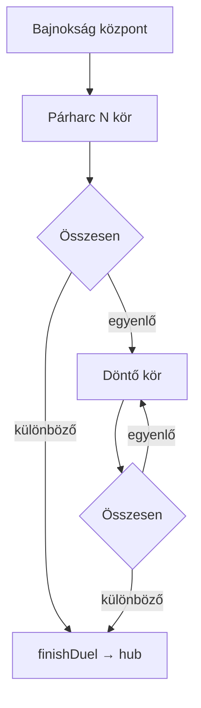

# Current Phase

## Phase

**Bajnokság Phase 3 — Duel + tie-break** (completed)

Phase 4 adds champion celebration and tournament finalize.

## Status

Completed — 2026-05-27

## Goals (Phase 3)

- [x] `TournamentDuelPage` — N-round scoring (`RoundScoreGrid`, `RoundNavigator`)
- [x] `TournamentTiebreakPage` — single-round playoffs, auto-repeat if tied
- [x] Replace `/tournament/duel` placeholder
- [x] Route `/tournament/duel/tiebreak`
- [x] Main duel totals → winner or tie-break (no manual winner)
- [x] Duel completion → hub; hub **Folytatás** routes to duel or tie-break
- [x] `npm run build` + `npm run test` pass

## What was built

| File | Purpose |
|------|---------|
| `src/pages/TournamentDuelPage.tsx` | Párharc score entry, összesen, lezárás |
| `src/pages/TournamentTiebreakPage.tsx` | Döntő kör flow, repeat if tied |
| `src/utils/tournament.ts` | `findDuelById`, `finishDuel`, `updateDuelById`, tie-break helpers |
| `src/pages/TournamentHubPage.tsx` | Folytatás → duel or tie-break when appropriate |
| `src/App.tsx` | Real duel + tiebreak routes |
| `src/index.css` | `.duel-totals`, `.tiebreak-page__*` |

## Routes

| Route | Screen |
|-------|--------|
| `/tournament/duel` | `TournamentDuelPage` |
| `/tournament/duel/tiebreak` | `TournamentTiebreakPage` |

Redirects: no active duel → `/tournament`; main incomplete on tiebreak → `/tournament/duel`; main tied on duel → `/tournament/duel/tiebreak`.

## Duel flow

| Step | UI | Logic |
|------|-----|--------|
| Score main rounds | `TournamentDuelPage` | `parseScoreInput`, 0–10 per player per round |
| All rounds filled | Összesen + **Párharc lezárása** | `compareMainDuelTotals` |
| Clear winner | — | `finishDuel`, `activeDuelId: null`, → hub |
| Tie | Redirect | `needsTieBreak` → tiebreak page |
| Tie-break round | **Döntő kör lezárása** | `compareTieBreakRound` on latest round |
| Still tied | New playoff | `appendTieBreakRound`, stay on page |
| Tie-break winner | — | `finishDuel` → hub |

**Out of scope:** manual winner pick buttons.

## `utils/tournament.ts` additions (Phase 3)

| Export | Role |
|--------|------|
| `findDuelById` / `getActiveDuel` | Resolve active párharc |
| `updateDuelById` | Immutable duel updates in bracket |
| `finishDuel` | Set `winnerId`, `completed`, clear `activeDuelId` |
| `getDuelMainTotals` | Display összesen on duel page |
| `getDuelRoundByIndex` / `canAdvanceFromDuelRound` | Round navigation |
| `getIncompleteTieBreakRound` / `appendTieBreakRound` | Tie-break playoffs |
| `winnerIdFromOutcome` | Map `'a'` / `'b'` → `playerId` |

## Verification

| Check | Result |
|-------|--------|
| `npm run build` | Pass |
| `npm run test` | 8/8 pass |
| Meccs routes | Unchanged |
| Round titles in duels | Omitted (per plan v1) |

## Manual smoke test (recommended)

- [ ] Start bajnokság (3+ players) → hub → párharc → score all rounds → lezárás → back to hub
- [ ] Force tie (equal totals) → döntő kör → resolve winner → hub
- [ ] Tie on döntő kör → second playoff → winner → hub
- [ ] **Következő szakasz** after all duels in round complete
- [ ] **Folytatás** reopens active duel or tie-break correctly
- [ ] Meccs flow still works

## Not in Phase 3 (by design)

- Champion celebration screen — Phase 4
- Tournament finalize / history — Phases 4–5
- Round funny titles in duels

## Next phase

**Phase 4 — Champion celebration**

- `TournamentChampionPage` (large **Bajnokság győztese**, trophy CSS)
- Optional confetti / applause
- Finalize tournament, prune, clear `activeTournamentId`
- Hub links to champion when `championId` set

## References

- [bajnoksag-plan.md](../bajnoksag-plan.md)
- [bajnoksag-phase0-review.md](../bajnoksag-phase0-review.md)

## History

- 2026-05-27 — MVP Meccs Phases 0–8.
- 2026-05-27 — Bajnokság Phase 0–2.
- 2026-05-27 — Bajnokság Phase 3: duel + tie-break scoring.
