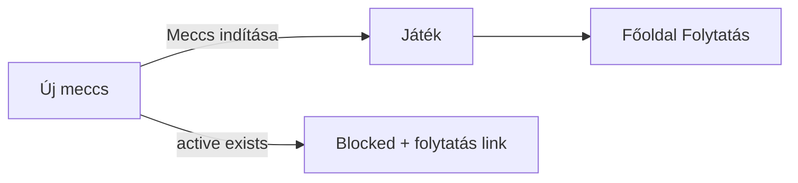

# Current Phase

## Phase

**Phase 3 — Új meccs** (completed)

Next: **Phase 4 — Score entry** ([phase-4.md](phases/phase-4.md))

## Status

Completed

## Goals

- [x] Select at least 2 players (max 12) via checkboxes
- [x] Round count stepper, default 6, range 1–20
- [x] Optional match name (fallback: `Szilveszter Cup — {date}`)
- [x] Create match with pre-allocated empty rounds
- [x] Set `activeMatchId` and persist
- [x] Redirect to `/match/play` (Játék)
- [x] Block new match when one is already active
- [x] Redirect `/match/play` to home if no active match
- [x] Hungarian UI throughout
- [x] No score entry yet (Phase 4)

## What was built

| File | Purpose |
|------|---------|
| `src/utils/match.ts` | `createMatch`, `clampRoundCount` |
| `src/components/match/MatchSetupForm.tsx` | Player pick, rounds, name, submit |
| `src/pages/NewMatchPage.tsx` | Új meccs page |
| `src/pages/PlayMatchPage.tsx` | Match summary stub + guard |
| `src/index.css` | Match setup + play-started styles |

## Flow

## Hungarian UI copy

| Situation | Message |
|-----------|---------|
| Too few players in app | Legalább 2 játékos kell… + link Játékosok |
| Too few selected | Válassz legalább 2 játékost. |
| Active match exists | Már fut egy meccs: {name} |
| Submit | Meccs indítása |
| Play stub | A körönkénti pontbevitel a következő fázisban érkezik. |

## Browser verification

**Dev server:** `http://localhost:5174/`

| Test | Result |
|------|--------|
| `/match/new` with 2 players | Checkboxes, round stepper (6), optional name |
| Select Anna + Béla, submit | Redirect to `/match/play` |
| Play page | Shows „Teszt Kupa”, 6 kör · 2 játékos, player chips |
| Home | **Folytatás — Teszt Kupa** link |
| localStorage | Active match has `rounds.length === 6` |
| Active match blocks new | Új meccs shows blocked state + folytatás link |
| Build | `npm run build` passes (54 modules) |

## Notes

- Player order in match follows sorted checkbox list (Hungarian locale).
- Játék page is a read-only stub until Phase 4 score grid.

## History

- 2026-05-27 — Phase 0: Scaffold.
- 2026-05-27 — Phase 1: localStorage state layer.
- 2026-05-27 — Phase 2: Játékosok CRUD.
- 2026-05-27 — Phase 3: Új meccs creation, active match, browser tests.
